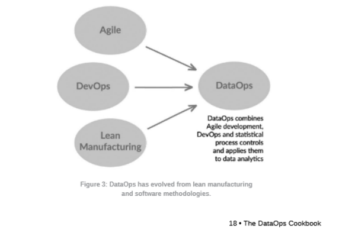
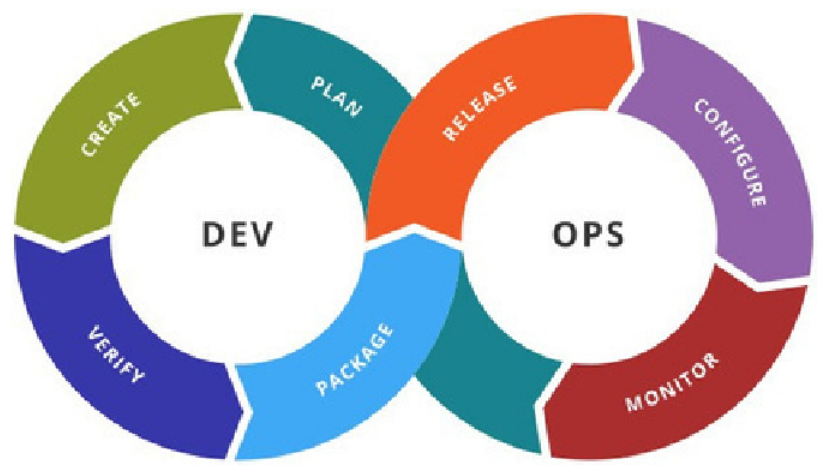

# Overview

Our data quality design process philosophy is heavily influenced by DataOps framework (see Data Quality Philosophy for more)

## Background materials

https://dataopsmanifesto.org/en/

## DataOps Defined
Combination of various software engineering and manufacturing best practices, ultimately treating all aspects of the pipeline (software, data, subsamples used in unit tests) as part of a CI/CD process.

DevOps is one component of DataOps, but it's not just simple adoption of "devops for data"

## DataOps Manifesto

1. Continually Satisfy Your Customer	Deliver valuable analytic insights early and continuously.	SELECT COUNT(*) FROM patient_data WHERE last_updated > NOW() - INTERVAL '1 day';
2. Value Working Analytics	Measure performance by the delivery of insightful and accurate analytics.	SELECT COUNT(*) FROM analytics_reports WHERE status = 'active';
3. Embrace Change	Welcome evolving customer needs to generate competitive advantage.	SELECT * FROM feature_requests WHERE status = 'pending';
4. It's a Team Sport	Encourage diverse roles and skills within analytic teams.	SELECT team_member, role FROM project_team WHERE project_id = 123;
5. Daily Interactions	Ensure daily collaboration among customers, analytic teams, and operations.	SELECT meeting_date, participants FROM daily_standups WHERE project_id = 123;
6. Self-Organize	Allow teams to self-organize for optimal results.	SELECT team_name, autonomy_level FROM teams WHERE project_id = 123;
7. Reduce Heroism	Create sustainable and scalable processes to minimize reliance on individual effort.	SELECT process_name, is_documented FROM workflows WHERE critical = TRUE;
8. Reflect	Regularly self-reflect to fine-tune operational performance.	SELECT feedback_date, action_items FROM retrospectives WHERE team_id = 456;
9. Analytics is Code	Treat analytics as code, versioning all aspects of the analytics process.	SELECT script_name, version FROM analytics_scripts WHERE project_id = 123;
10. Orchestrate	Coordinate data, tools, code, environments, and team efforts for success.	SELECT workflow_name, status FROM orchestrations WHERE project_id = 123;
11. Make it Reproducible	Ensure results are reproducible by versioning everything.	SELECT dataset_name, version FROM datasets WHERE project_id = 123;
12. Disposable Environments	Provide easy-to-create, isolated, and disposable environments for experimentation.	SELECT environment_id, status FROM dev_environments WHERE user_id = 789;
13. Simplicity	Focus on simplicity to enhance agility and efficiency.	SELECT process_name FROM processes WHERE complexity = 'low';
14. Analytics is Manufacturing	Apply process-thinking to achieve continuous efficiencies in analytics.	SELECT stage, efficiency_metric FROM analytics_pipeline WHERE project_id = 123;
15. Quality is Paramount	Build pipelines capable of automated detection of abnormalities and security issues.	SELECT check_name, status FROM quality_checks WHERE pipeline_id = 123;
16. Monitor Quality and Performance	Continuously monitor performance, security, and quality measures.	SELECT metric_name, value FROM performance_metrics WHERE pipeline_id = 123;
17. Reuse	Avoid repetition by reusing previous work.	SELECT component_name, usage_count FROM reusable_components WHERE project_id = 123;
18. Improve Cycle Times	Minimize the time from customer need to analytic insight.	SELECT request_id, time_to_completion FROM customer_requests WHERE project_id = 123;

# Steps to Implement DataOps
## Step 1 - Add data and logic tests

Inspired by Statistical Process Control (SPC; from manufacturing)SPC: Data stays within an acceptable statistical range
tests validate data values at the inputs and outputs of each processing stage in the pipelinethis implies fixing and or flagging the data. For WinshipOMOP, we "quarantine" all signal
There is a necessary feedback loop whenever the logic test is put in place. The test is created, someone is notified, it's acted upon, test is rerun, etc., until the loop is escaped by the agreed upon measure of success.

## Step 2 - Use Version Control

I would extend their definition and push for versioning of code, documentation, tests, and meetings all aligned within context of versions. It's critical we understand all aspects of version up and down the stack.

## Step 3 - Branch and Merge

As stated for step 2, I would argue we should have such items up and down the entirety of the infrastructure.

## Step 4 - Use Multiple Environments

Implement "Test Kitchens" where individual developers can play around with an environment

## Step 5 - Reuse and Containerize

Specific non-obvious note: It's a good idea to allow for endpoints that other engineers/analysts can utilize without having to really touch the guts in some cases: Just setup the container locally, and then utilize as needed.

## Step 6 - Parameterize your processing

Specific non-obvious note: Which version of raw data should be used? Is the data for production or for testing? Records have changing filters? Should specific processing steps in workflow be included?

If the data-analytic pipeline is designed with the right flexibility, it will be ready to accommodate different run-time circumstances. I'd argue that atomizing code sets this up well as it's easy to run or not run a particular step for testing.This is untested though. It's been successful-ish for winomop

## Step 7 - Work without fear or heroism

### 🚧 Remainder Sections under constuction as of release date 🚧